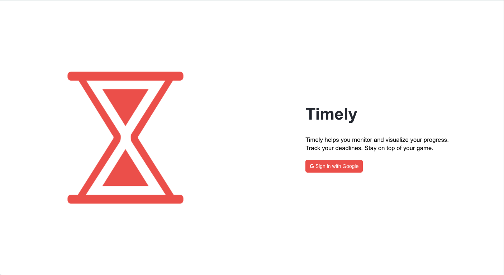
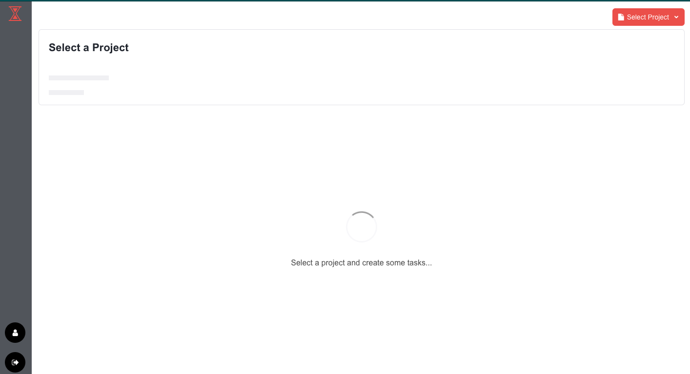
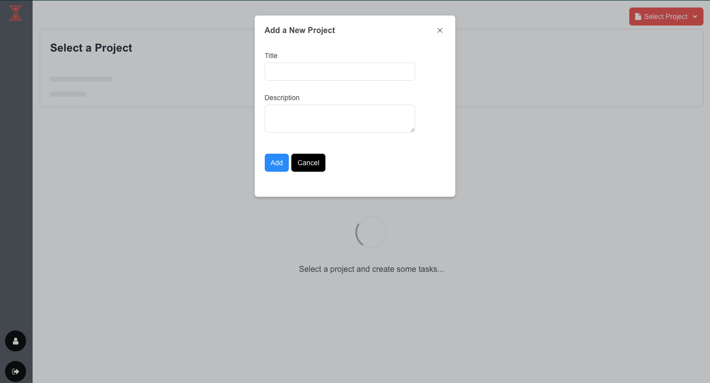
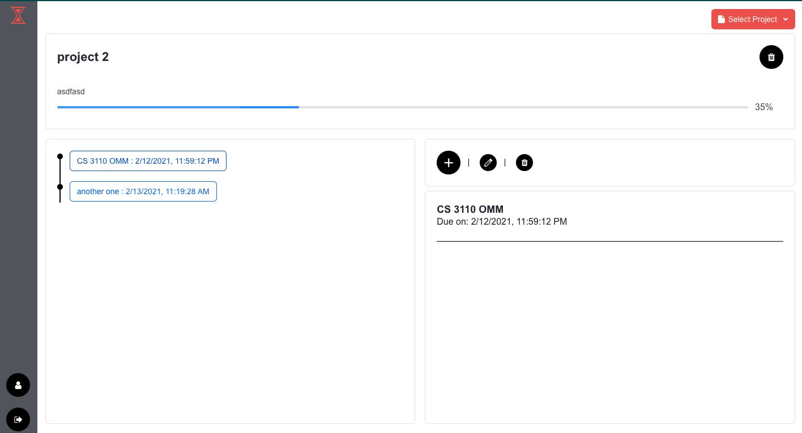

## **React Front End**

#### The landng page

#### After logging in with google with an account with no projects

#### Hovering over the select projects dropdown will give the option to create a project

#### Unfnished project tab. Clicking on a task on the timeline will show task details and a progress bar that tracks how much of the entire project was completed

